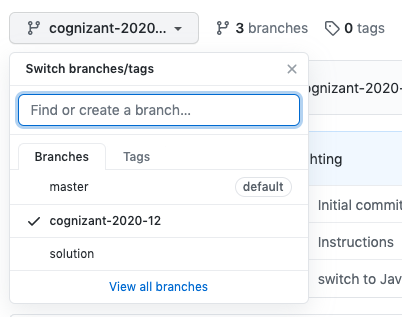

# Shopping Cart Lab

You have been hired as a developer at Ali Snobba - a snobby online store where customers purchase high-end merchandise like Louis Vuitton handbags and Rolex watches. Your job is to implement a shopping cart that stores items while customers are in the process of ordering.

## Object Specifications

A shopping cart `Item` should have the following model:

| Item   |            |
|--------|------------|
| name   | String     |
| price  | currency   |
| onSale | bool       |

The shopping `Cart` should have the following model:

| Cart               |           |
|--------------------|-----------|
| getItems()         | Item(s)   |
| addItem(Item, int) | void      |
| itemizedList()     | String(s) |
| itemQuantities()   | String(s) |
| onSaleItems()      | String(s) |

`addItem()` should take two parameters:

1. An `Item` Object
1. An integer `quantity`

`itemQuantities()` should return one String for each type of item in the cart in the following format:

```Java
{
    'Handbag - x2', 
    'Watch - x4'
}
``` 

`itemizedList()` should return one String for each item in the cart in the following format:

```JavaScript
{
    'Handbag x1 - $500.00', 
    'Watch x2 - $40,000.00'
}
``` 

`onSaleItems()` should return one String for each item in the cart marked as `onSale` in the following format:

```Java
{
    'Handbag x1 - $250.00', 
    'Watch x2 - $20,000.00'
}
```

## Instructions

As a developer, your task is to implement the following user story, following the TDD workflow:

- Write (failing) tests before writing any code
- Only write code in response to failing test
- Make tests pass with simplest code possible
- Make a commit in git each time you get a passing test
- After getting each test to pass, refactor your code and tests to be as concise as possible
- Make another commit each time you finish a refactor
- Submit the link to your completed code in [Learn]().

### Getting Started

***Be sure to fork:***


You will know you have forked if you see the project in Github under your github account:


**share the fork with your team** so that everyone can contribute to the code!

**Select the right branch:**



***then Clone your fork:***


Once cloned, you start by setting up a Java project in the project. Make sure to commit once your Java project is set up. IE your first commit should be your working, empty Java project.

### Tips

* Establish rapport with your pair!
* Establish when you'll swap roles (ping pong)
* Take breaks at least once an hour.

## Acceptance Criteria:

Ali Snobba has given you the following criteria to determine completeness of your project.

1. Given that I a new shopper, when I begin shopping, then I expect my cart to be empty.
1. Given I have an empty cart, when I add an Item, then I expect to `getTotalPrice()` reflect the sum of all the Items in my cart, times the quantities of each item.
1. Given I have an empty cart, when I add more than one of an item, then I expect `itemQuantities()` to show the number of items I have added.
1. Given I have an empty cart, when I add items, then I expect `itemizedList()` reflect the items I have added along with their price and quantity.
1. Given I have an empty cart, when I add more than one of an item, then I expect `getTotalPrice()` to reflect both the item price and quantity.
1. Given I have a cart with items that are not on sale, when I add items that are on sale, I expect `onSaleItems()` to include only the items on sale.

## Stretch Goals

If you get finished early, feel free to work towards these additions. This is not a exhaustive or exclusive list. Discuss with your pair what kind of improvements or changes you can make to this project.

- Add a UI of some kind
- Turn it into an API server so you can make requests against a shopping cart
- Store the data in a Database

## Additional Resources
- [Working with Currency](http://vanillajava.blogspot.de/2011/08/double-your-money-again.html)
- [String.format](https://dzone.com/articles/java-string-format-examples)
 
